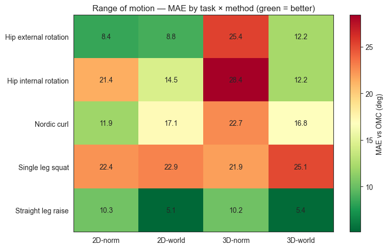

# MediaPipe Kinematic Tracking & 3D World Coordinate Benchmarking

An end-to-end Python processing and evaluation pipeline for monocular markerless motion capture (MMC). This repository extends a benchmark framework by evaluating **MediaPipe Pose** (2D normalised vs. 3D real-world coordinates in meters) against 100 Hz optical motion capture (OMC) ground truth.

---

## 📌 Context & Motivation

Prior work evaluated 2D OpenPose keypoints across 12 motor tasks using a single smartphone setup. While 2D monocular tracking demonstrated high agreement for vertical jump height and barbell velocity, it showed inaccuracy when used for more advanced tasks including 3D angle metrics.

This repository addresses those limitations by:
1. Upgrading the processing pipeline to **MediaPipe Pose**.
2. Benchmarking both 2D normalised (x, y, z) and 3D camera-centric world coordinates (X, Y, Z in meters) against 3D optical motion capture ground truth.

---

## 🛠️ Repository Structure

```text
├── data/
│   ├── keypoints/                  # Normalised and world co-ordinates
│   ├── pickle/                     # OMC ground truths
│   └── dj_manual_segs.json         # Manual segmentation metadata
├── notebooks/
│   ├── archive/                    # Legacy/experimental notebooks
│   ├── 01_mediapipe_normalised.ipynb
│   ├── 02_full_coordinate_comparison_screening.ipynb
│   ├── 03_full_cooridnate_comparison.ipynb
│   └── posedata.py                 # Pose data handling utilities
├── results/                        # Output plots and benchmarking metrics
├── tasks/                          # Motor task scripts
│   ├── cmj.py                      # Countermovement Jump
│   ├── dj.py                       # Drop Jump
│   ├── hip.py                      # Hip mobility
│   ├── nordic.py                   # Nordic Hamstring exercise
│   ├── rjt.py                      # Repeated Jump Test
│   ├── slr.py                      # Straight Leg Raise
│   ├── sls.py                      # Single Leg Squat
│   └── velocity.py                 # Barbell/movement velocity tracking
├── utilities/                      # Core helper routines
├── .gitignore
├── README.md
└── requirements.txt                # Python dependencies
```

---

## 📊 Methodology & Signal Processing

1. **Multi-Dimensional Keypoint Extraction:**
   Extracts 33 body landmarks frame-by-frame using MediaPipe Pose (`model_complexity=2`), yielding:
   * **2D Normalised Coordinates:** Keypoint coordinates scaled [0.0, 1.0] relative to image width/height.
   * **3D World Coordinates:** Real-world 3D coordinates in meters centered at the subject's hip midpoint.

2. **Signal Smoothing:**
   Extracted keypoint series are smoothed using a second-order **Savitzky-Golay filter** to preserve movement extrema (e.g., peak jump height, maximum range of motion) while filtering high-frequency jitter.

3. **FFT Resampling & Synchronization:**
   To align 30 fps smartphone video streams with 100 Hz Codamotion OMC ground truth, time-series data are upsampled using **Fast Fourier Transform (FFT) resampling** to minimize signal distortion.

4. **Repetition Segmentation:**
   Automatically segments repetition windows around maximum displacement extrema.

---
## 📈 Key Results

Range of motion (ROM) metrics were evaluated across tasks against 100 Hz optical motion capture (OMC) ground truth. Performance was quantified using Mean Absolute Error (MAE in degrees) across four MediaPipe coordinate representations: **2D Normalsed**, **2D World**, **3D Normalised**, and **3D World**.



### MAE Breakdown (vs. OMC Ground Truth)

| Movement Task | 2D-norm (° MAE) | 2D-world (° MAE) | 3D-norm (° MAE) | 3D-world (° MAE) |
| :--- | :---: | :---: | :---: | :---: |
| **Hip external rotation** | **8.4** | 8.8 | 25.4 | 12.2 |
| **Hip internal rotation** | 21.4 | 14.5 | 28.4 | **12.2** |
| **Nordic curl** | **11.9** | 17.1 | 22.7 | 16.8 |
| **Single leg squat** | 22.4 | 22.9 | **21.9** | 25.1 |
| **Straight leg raise** | 10.3 | **5.1** | 10.2 | **5.4** |

### Key Takeaways
* **Planar Accuracy:** Plane movements (e.g., *Straight Leg Raise*) achieved the highest agreement with OMC, reaching errors as low as **5.1° MAE** (`2D-world`) and **5.4° MAE** (`3D-world`).
* **World Coordinate Advantage:** Transitioning to real-world camera-centric metrics (`3D-world`) markedly improved rotational joint accuracy—halving internal hip rotation error compared to normalised 3D data (**12.2°** vs **28.4°**).
* **3D Normalised Artifacts:** `3D-norm` coordinates consistently suffered from higher distortion during out-of-plane rotational movements due to depth-scale ambiguity.
* **Complex Multi-Joint Tasks:** *Single Leg Squat* exhibited consistent error (~22°–25° MAE) across all coordinate spaces, highlighting ongoing challenges with this type of motion.


## 🚀 Quick Start

### Installation
```bash
git clone [https://github.com/dylanbyrne3454/machine_vision_media_pipe.git](https://github.com/dylanbyrne3454/machine_vision_media_pipe.git)
cd machine_vision_media_pipe
pip install -r requirements.txt
```

### Dependencies
* `opencv-python`
* `mediapipe`
* `numpy`
* `scipy`
* `pandas`
* `matplotlib`

---

## 📖 Reference & Prior Work

This pipeline builds upon research conducted at the **Insight SFI Centre for Data Analytics, University College Dublin**:

> **Aderinola, T. B., Younesian, H., Goulding, C., Whelan, D., Caulfield, B., & Ifrim, G.** (2023). *Machine Vision-Enabled Sports Performance Analysis*. arXiv preprint arXiv:2312.11340[cite: 1].

---

## 👨‍💻 Author

**Dylan Byrne**  
*Undergraduate Electronic Engineering Student, University College Dublin (UCD)*  
Research conducted under the supervision of **Timilehin B. Aderinola** at **Insight SFI Centre for Data Analytics**.